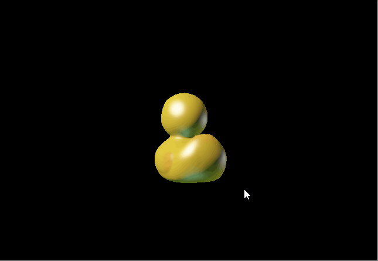
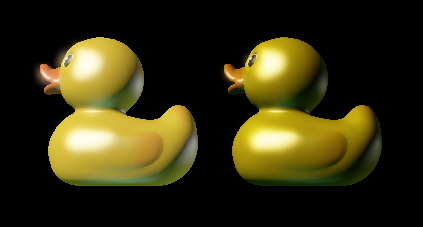
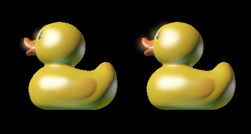

CUDA Rasterizer
===============

**University of Pennsylvania, CIS 565: GPU Programming and Architecture, Project 4**

* Daniel McCann
* Tested on: Windows 10, i7-5700HQ CPU @ 2.70GHz, GeForce GTX 970M, 16 GB RAM

### Overview

This is a manual implementation of the real-time graphics pipeline provided by APIs like OpenGL, DirectX and Vulkan on CUDA.

3D mesh objects are stored as a collection of triangles. Triangle vertices store positions, normals (surface direction at point) and other data like texture coordinates. First, the triangles are transformed to screen space (vertex shader) and their vertex data is transformed to view space for shading. Then the triangles are rasterized in parallel; they are split into fragments where they overlap with pixels on the screen to be colored later. Then the fragments are rendered (fragment shader). Finally the rendered image is modified and color corrected (post processing) and uploaded to the screen.

### Extra Features

# HDR Lighting and Tonemapping

The rasterizer buffers are floats instead of bytes, allowing for color values to exceed 1. This means any nummber of lights can add color to a surface, and after the rendering steps are done the range will be shrunk back down to 0-1 using an exposure function. Then, the image is gamma corrected. (this also required textures to be gamma-uncorrected, done manually in this rasterizer)

The current material is a blinn-phong shader with three directional lights.

Above: with and without gamma correction. Without gamma correction, diffuse falloff is too gradual and dimmer lights contribute very little to the model.

Above: exposure 0.5 and exposure 1.5. The increase in brightness is logarithmic. With higher exposure, the second and third light sources are more evident.

# Bloom

Above: the model with and without bloom.

Bloom is a glow effect applied around especially bright areas. Since this requires many per-pixel operations, it is calculated on a quarter resolution and upscaled with a bilinear filter. The steps are as follows:
* Apply a high pass filter to the kernel. Colors with HDR intensity are put into a new buffer.
	* HDR intensity means dot(color, color) > 3. In non HDR color space, the max value of the dot product is 3.
	* Four pixels of the original image will be averaged for this buffer.
	* This uses a response curve: instead of having a hard cutoff, pixels are weighted by a smooth curve based on their intensity above 3. Right now a pixel with an intensity of 5 has full effect.
* Apply horizontal gaussian blur to the new buffer
* Apply vertical gaussian blur to the new buffer. This makes a circular blur.
* Smoothly upscale the new buffer to full resolution and add it to the original color. Because the buffer was a blurred, upscaling artifacts are minimal. 

Above: comparison without and with a second blur pass.

# Perspective Correct Filtering

Triangle attributes are normally interpolated with barycentric coordinates. But since the triangles have been projected to the 2D screen plane, they do not account for the z coordinate / depth properly. This means that shading attributes such as view space position, surface orientation, and texture coordinates are not accurate. Correcting this just requires a few extra weights based on the z coordinates of each vertex.

# Bilinear Filtering

Images are stored as arrays of bytes representing colors for each pixel. When picking colors from a texture with coordinated, picking individual colors can create an aliasing or jagged edge effect since there is no transition across texture pixels. With bilinear filtering, the renderer samples four pixels and creates a weighted blend.

Above, you can see the eye texture without and with bilinear filtering. For a negligible performance hit, you get smooth texture transitions.

### Feature Performance

# Pipeline Stages

.png)

Rasterize got considerably slower when the mesh is closer to the camera than the tile based rendering, but vertex transform and assembly seemed to be the slowest stage here.

Post processing is also quite slow. However, it does not change when the mesh fills less of the screen, but the fragment shader does.

# Feature FPS
On the default camera, duck model:

* All features: 275 FPS
* 2 Pass Bloom: 248 FPS
* Disabled Bloom: 386 FPS
* Disabled Bilinear Filter: 277 FPS

Takeaways:
* Blur kernels cost 27 fps. Therefore the downscaling / upscaling kernels cost 84 fps.
* Bilinear filter saved 2 fps, almost nothing. The result is essential.

### Credits

* [tinygltfloader](https://github.com/syoyo/tinygltfloader) by [@soyoyo](https://github.com/syoyo)
* [glTF Sample Models](https://github.com/KhronosGroup/glTF/blob/master/sampleModels/README.md)
